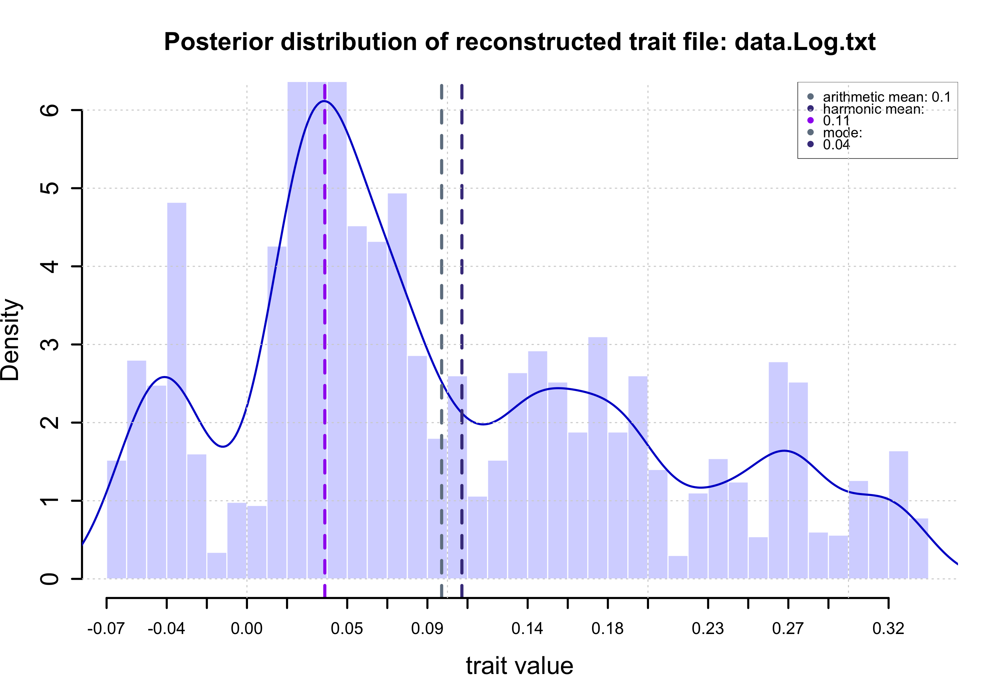
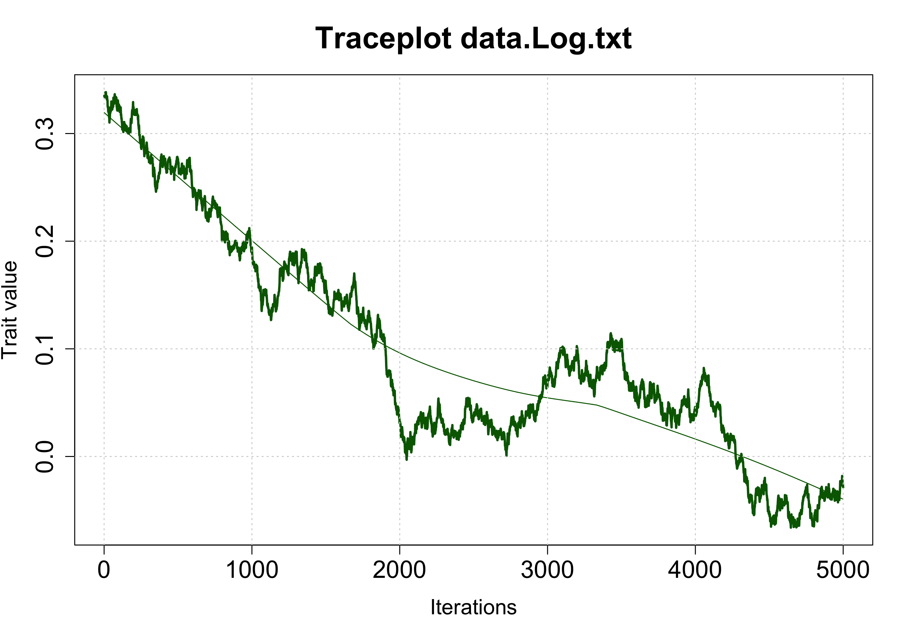

# BayesTraitsSummary. Automatic summary of log files from Ancestral Trait Reconstruction by Bayesian Methods in BayesTraits

## Description

BayesTraitsSummary is a lightweight tool designed to simplify the interpretation and post-inference analysis of ancestral quantitative trait reconstructions performed with the Bayesian method in BayesTraits.
With a single command, you can analyze multiple BayesTraits log files at once.
For each analyzed file, the script generates:

A posterior distribution plot of the reconstructed trait.
A .csv file containing:
HPD intervals
ESS metrics
Heidelberger–Welch test results
Harmonic and arithmetic means of the reconstructed trait
Mode of the posterior distribution
A trace plot

## Input files

You only need:
Log files from an ancestral quantitative trait reconstruction in BayesTraits.
Important: The log file names must contain the word "Log".
Example files can be found in the data directory.

---

## Example Image

Posterior distribution

Traceplot

## Necessary programs and libraries

- R (>= 4.0)
- Packages from R:
  - HDInterval
  - coda
  - posterior

---

## How to Run

The first step is move your Log files to the data directory. After that change your working directory to the bin directory and run this 
script as follows:

./summary.sh

Author: José Emilio Ramírez Piña
