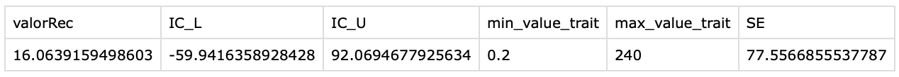

# ScriptsBayesTraits. Automatic script generator for ancestral state reconstruction of quantitative traits for BayesTraits

## Description

ScriptsBayesTraits is a tool designed to simplify the creation of BayesTraits scripts for ancestral state reconstruction of 
quantitative traits. Its key feature is the ability to define uniform priors objectively, based on maximum likelihood estimations, 
rather than setting them arbitrarily. Additionally, the program generates scripts for each internal node of the phylogenetic tree, 
making it easier to select which nodes you want to reconstruct. This avoids the tedious process in BayesTraits where you must 
manually specify the descendants of a node to perform inference.

Working with BayesTraits can be powerful, but let’s be honest—it often feels tedious when it comes to setting up scripts, defining priors, and specifying which internal nodes to reconstruct. ScriptsBayesTraits automates all of that for you.
This tool doesn’t just generate BayesTraits scripts—it does the heavy thinking beforehand:

Objective priors: Instead of arbitrary ranges, ScriptsBayesTraits estimates ancestral values via Maximum Likelihood and uses them to define a uniform prior with a data-driven lower and upper bound.
Node-focused workflow: It automatically detects descendants for every internal node in your tree, exports a labeled PNG (so you can see where to work), and creates organized directories for each node.
Streamlined outputs: For every node, you get a clean CSV file with ancestral estimates, confidence intervals, min/max descendant values, and standard errors.
Plug-and-play scripts: Finally, it writes fully functional BayesTraits scripts that include everything—evolutionary model, priors, MCMC parameters, burn-in, sampling frequency, and the exact descendant tags you need.

In short, ScriptsBayesTraits transforms the frustrating, error-prone setup process into a clear, automated, and reproducible workflow. You stay focused on the science—while the tool takes care of the setup.

## Summary of the tool work-flow

The tool first identifies the descendants of each internal node in the phylogenetic tree and exports the tree as a PNG image (useful for locating the internal nodes you want to reconstruct). Then, it creates a directory for each internal node, which will contain the corresponding output files. Next, it performs ancestral state reconstruction of the trait using maximum likelihood. For each ancestral node, it generates a CSV file that includes the estimated value, confidence interval, minimum and maximum values of its descendants, and the standard error. Based on this information, the tool determines the priors: by default, it sets a uniform prior where the lower bound is calculated as the ancestral value minus the standard error, divided by a user-defined factor. It also adjusts the number of iterations according to the user-specified percentage of burn-in. Finally, with all this information, the tool writes the BayesTraits script, specifying the evolutionary model, method, priors, iterations, burn-in, sampling frequency, and the tags that indicate the descendants of each node.

After run this script generates:

A tree with labeled nodes in newick format and an png of the tree
A directory for each internal node that contain:
  
  -A Bayes traits script to perform ancestral character reconstruction by Bayesian inference for the corresponding node
  -A txt file that indicates the descendants for the corresponding node
  -A csv file with the results of the ancestral state reconstruction of the trait by maximun likehood for the corresponding node

## Input files

A phylogenetic tree in NEXUS format with taxa block
A tab-separated file containing the quantitative trait data without header

Example file are available in the data directory

bin/ → Contains the scripts needed to run PhyloTags.
data/ → Place your input tree file here.
Results/ → All generated output files will be saved here(this directory will be generated after run the script)

---

## Output example 

Labeled tree

Example of a .txt file that containt the descendants of Node 2

Node2 Treponema_pallidum Chlamydia_pneumonia Lactobacillus_plantarum Prochlorococcus_marinus Synechococcus_sp Anabaena_variabilis Nostoc_sp Campylobacter_jejuni Buchnera_aphidicola_1 Erwinia_carotovora Mannheimia_succiniciproducens Aeromonas_hydrophila Methylococcus_capsulatus Legionella_pneumophila Dinoroseobacter_shibae Bartonella_henselae Brucella_melitensis Bradyrhizobium_japonicum Geobacter_sulfurreducens Rubrobacter_xylanophilus Arthrobacter_aurescens Mycobacterium_leprae Mycobacterium_avium Gramella_forsetii Porphyromonas_gingivalis Ehrlichia_canis Anaplasma_marginale Rickettsia_conorii

Example of a bayestraits script for the ancestral trait reconstruction of the node 2

4
2
PriorAll uniform -9.78831256806593333333 41.91614446778653333333
Iterations 100000000
Burnin 50000000
Sample 1000
AddTag Node2 Treponema_pallidum Chlamydia_pneumonia Lactobacillus_plantarum Prochlorococcus_marinus Synechococcus_sp Anabaena_variabilis Nostoc_sp Campylobacter_jejuni Buchnera_aphidicola_1 Erwinia_carotovora Mannheimia_succiniciproducens Aeromonas_hydrophila Methylococcus_capsulatus Legionella_pneumophila Dinoroseobacter_shibae Bartonella_henselae Brucella_melitensis Bradyrhizobium_japonicum Geobacter_sulfurreducens Rubrobacter_xylanophilus Arthrobacter_aurescens Mycobacterium_leprae Mycobacterium_avium Gramella_forsetii Porphyromonas_gingivalis Ehrlichia_canis Anaplasma_marginale Rickettsia_conorii
AddMRCA trait Node2
Run

Example of the csv that contains the results of the ancestral trait reconstruction of node 2 by maximun likehood

---

## Necessary programs and libraries
- R (>= 4.0)
- Packages from R:
  - ape
  - diversitree

---

## How to Run

The first step is move your tree in nexus format and your trait data to the data directory. After that change your working directory to the bin directory and run this script as follows with this arguments in this order:

1-Name of your tree
2-Name of your data trait
3-Number of iterations that you want
4-The frequency of the sample the MCMC (between 0-iterations number)
5-Percentage of burnin (between 1-98)
6-Evolutionary model (4 for wandom-walk or 5 for directional)
7–The divisor applied to the standard error (must be >1). This reduces the standard error, resulting in a narrower range for the uniform prior, if desired.

Example of how to run:

./ScriptsBayesTraits.sh tree.nex data.txt 1000000 1000 10 4 3

Author: José Emilio Ramírez Piña
