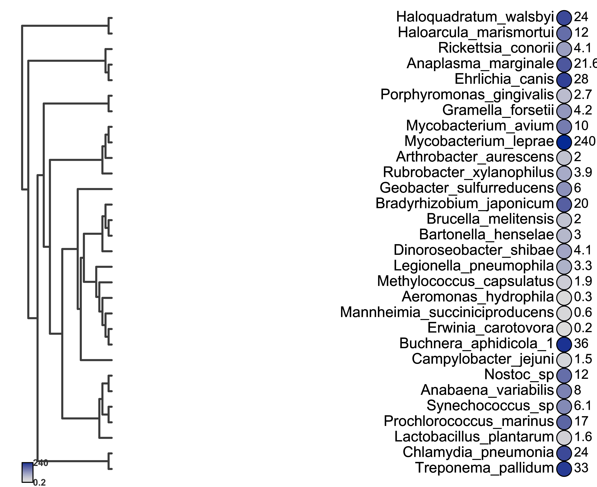

# TraitTree. Visualization of a Phylogenetic Tree with Quantitative Trait Values

## Description
This tool generates an image of a phylogenetic tree and, next to each taxon, displays the value of a quantitative trait.  
The value is shown both as a number and as a color-coded circle, where the gradient intensity represents the magnitude of the trait.

To run the script you only need two files:
1. **A Nexus tree** with a taxa block.
2. **A tab-delimited `.txt` file** with:
   - The species names (matching those in the tree) in the first column.
   - The quantitative trait values in the second column.
   - No column names (headerless file).

You can find example files for try it use the code c:
---

## Example Image

---

## Requirements
- R (>= 4.0)
- Packages:
  - ape
  - colorspace

---

## How to Run

### **From the terminal**

Rscript TraitTree_script.R tree.nex data.txt

tree.nex → Phylogenetic tree in Nexus format.
data.txt → Tab-delimited file with numeric trait values for each species.

### **From R**

You can also run the code in TraitTree_function.R directly within your R session.
Before using the function, load your data:

library(ape)

tree <- read.nexus("tree.nex")
data <- read.csv("data.txt", sep = "\t", header = FALSE)

Then call the function:

TraitTree(tree, data)

Author: José Emilio Ramírez Piña
